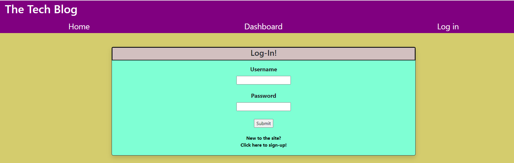

# Model-View-Controller Tech blog

[Link to website]()

## Description
After creating an account on this short-form blogging site, users can create, edit, and delete their own posts while commenting on others'.

## Screenshot

## Installation
N/A

## Usage

### Signing Up
* To sign up, click on the *Log in* link and then the *New to the site?* link below the submit button. 
* Enter your desired username and password. 
* Click submit. 
* You will be redirected to your Dashboard. 

### Logging in
* Click on either the *Log in* link or the *Dashboard* link. 
* Enter in your username and password. 
* Click submit. 
* You will be redirected to your Dashboard.

### Viewing Posts and comments
* For an overview of posts, click on the *Home* link.
* To view comments, click on the post header/name while on the Home page. 

### Creating posts
* You must be logged in to create posts.
* Click on the *Dashboard* link. 
* Click the *+ New Post* button.
* Enter your desired title and post content. 
* Click submit. 
* You'll be redirected to your Dashboard where you'll now see the entry of your new post. 

### Editing posts
* You must be logged in to edit your posts.
* Return to your Dashboard. 
* Click on the desired post to edit. 
* Your current content will be displayed.
* Delete or retype said content as desired. 
* Click submit to post the updated text. 
* Click delete to remove the post entirely. 
* You'll be returned to your Dashboard where you'll be able to view your changes. 

### Adding comments 
* You must be logged in to create comments. 
* Click on the *Home* link. 
* Click on the post you'd like to comment on.
* At the bottom, enter your comment in the comment box. 
* Click submit. 
* Your comment will be added to the feed. 

## References
* Our instructor gave us starter code
* [Referenced for session saving](https://expressjs.com/en/resources/middleware/session.html)
* [Referenced for session saving](https://stackoverflow.com/questions/26531143/sessions-wont-save-in-node-js-without-req-session-save)
* [Referenced throughout for various issues](https://sequelize.org/docs/v6/)

## License
Please refer to the license in the repo.
- - -
